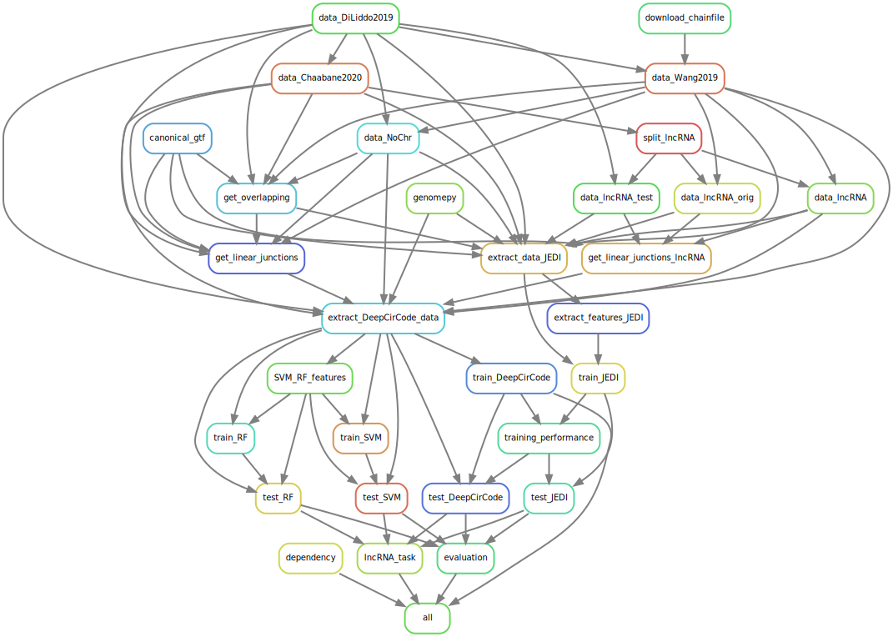
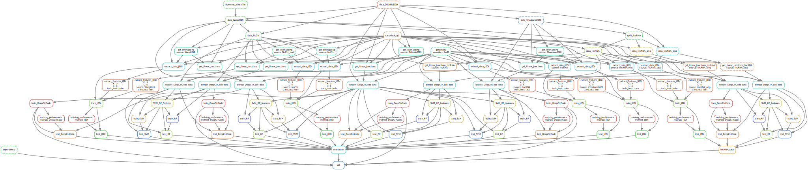

# CircRNA Backsplice Code
This repository aims at benchmarking different DNA-based models that identify circRNAs.

## Authors

* Michaela Müller (mumichae@in.tum.de)
* Laura Jahn
* Peter Weber

## Usage
*adapted from [Snakemake cookie cutter](https://github.com/snakemake-workflows/cookiecutter-snakemake-workflow)*

### Step 1: Obtain a copy of this workflow

Clone this repository to your local system, into the place where you want to perform the data analysis.
As this project contains submodules, use the following command:

```commandline
git clone --recursive https://github.com/mumichae/backsplice_code.git
```

### Step 2: Configure workflow

Configure the workflow according to your needs via editing the files in the `config/` folder.
Adjust `config.yaml` to configure the workflow execution.

### Step 3: Setup environments

This project contains conda environment files in `workflow/envs`.
The environment `workflow/envs/circRNA_benchmark.yaml` is dedicated to running the pipeline and calling most benchmarking steps. 
The remaining environments are specific to the methods included in this benchmark.
In order to call the pipeline, create the `circRNA_benchmark` environment:

```commandline
conda env create -f workflow/envs/circRNA_benchmark.yaml
```

> Note: you can use mamba instead of conda for faster installs.
> Check out the [documentation](https://mamba.readthedocs.io) on how to install mamba.

Additionally, the environment for `DeepCirCode` needs to be created manually and environment variables set.

```commandline
conda env create -f workflow/envs/DeepCirCode.yaml
```
Set the `LD_LIBRARY_PATH` and `RETICULATE_PYTHON` variables as described in conda's [documentation](https://docs.conda.io/projects/conda/en/latest/user-guide/tasks/manage-environments.html#saving-environment-variables).

Activation script `$CONDA_PREFIX/etc/conda/activate.d/env_vars.sh`:

```shell
LD_LIBRARY_PATH_OLD=$LD_LIBRARY_PATH
export LD_LIBRARY_PATH_OLD
LD_LIBRARY_PATH=$CONDA_PREFIX/lib

export RETICULATE_PYTHON=$CONDA_PREFIX/bin/python
```

Deactivation script `$CONDA_PREFIX/etc/conda/deactivate.d/env_vars.sh`:

```shell
LD_LIBRARY_PATH=$LD_LIBRARY_PATH_OLD
unset LD_LIBRARY_PATH_OLD
export LD_LIBRARY_PATH

unset RETICULATE_PYTHON
```

Note, that the necessary directories should already exist after creating the environment.

### Step 4: Execute workflow

Activate the conda environment:

```commandline
conda activate circRNA_benchmark
```

Test your configuration by performing a dry-run via

```commandline
snakemake --use-conda -n
```

Execute the workflow locally via

```commandline
snakemake --use-conda --cores $N
```

using `$N` cores or run it in a cluster environment via

```commandline
snakemake --use-conda --cluster qsub --jobs 100
```

If you not only want to fix the software stack but also the underlying OS, use

```commandline
snakemake --use-conda --use-singularity
```

in combination with any of the modes above.
See the [Snakemake documentation](https://snakemake.readthedocs.io/en/stable/executable.html) for further details.

### Step 5: View dependency graph

It is always useful to have a graphical overview of what the pipeline does.
This pipeline has a rule that creates a graph image of the steps.
Simply call

```commandline
snakemake dependency -j
```

to generate it.
The resulting files are specified in `config/config.yaml` under `dependency_graph`.

The `rulegraph` just visualises the general steps as defined by the rules.


The `dag` shows all the different jobs that will be run, for every wildcard specified in `configs/params.tsv`.


## Folder Structure

```shell
├── config
│   ├── config.yaml          # configurations for output files and global parameters
│   └── params.tsv           # table of wildcards constellations of methods
├── dependency_dag.svg       # dependency graph (all jobs)
├── dependency_rulegraph.svg # dependency graph (rules)
├── methods
│   └── circDeep
├── README.md
├── resources
├── results
│   ├── evaluation
│   ├── logs
│   ├── models
│   └── processed_data
└── workflow
    ├── envs
    ├── rules
    ├── scripts
    │   ├── common.py
    │   ├── data   
    │   ├── evaluation
    │   └── models
    └── Snakefile
```
